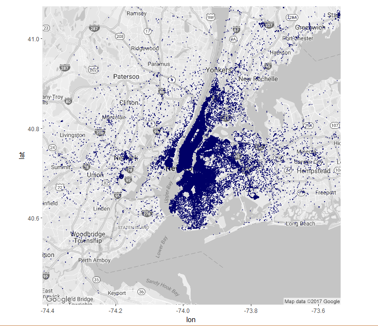

# UBER PICKUPS IN NEW YORK CITY
## Data visualization using R  

## Contributors:
+ Shon Inouye
+ Edward Kim

## Introduction
This repo is dedicated to create data visualization for uber and other for-hire vehicle pickups in New York City. We used datasets from [Kaggle](https://www.kaggle.com/fivethirtyeight/uber-pickups-in-new-york-city). The goal of this project was to visualize the data in different ways and point out any interesting discoveries.
One thing we sought to discover was the meaning behind the base codes that accompanied each uber pickup. A quick search led to these codes being associated with several of Uber's bases.

Base Code | Base Name
---|---------
B02512 | Unter
B02598 | Hinter
B02617 | Weiter
B02682 | Schmecken
B02764 | Danach-NY
B02765 | Grun
B02835 | Dreist
B02836 | Drinnen

These are Uber's bases located in New York. Each uber pickup is affiliated with a TLC (Taxi and Limousine Commission) company base. 

## Loading Packages

    library(ggplot2)
    library(plotly) #used along with ggplot2 for data visualization.
    library(ggmap)  #used for geocoding
    library(plyr)   #used along with dplyr to aggregate data
    library(dplyr)

## Plot of Total Uber Pickups
First, we read the data taken from Kaggle.com. In order to keep the plot simple, we only used Uber pickup data from April 2014. 

    # Read data
    uber_apr14 <- read.csv("/Users/Shon/Documents/MyProjects/Data Science/uber data visualization/uber-pickups-in-new-york-city/uber-raw-data-apr14.csv")

After reading the data, added a column for the day of the week. This will be used later on to plot the data over the course of the month.

    # Remove minutes and seconds from Date.Time and create Day column
    uber_apr14$Date.Time <- as.Date(uber_apr14$Date.Time, "%m/%d/%Y")
    uber_apr14$Day <- format(as.Date(uber_apr14$Date.Time, format = "%m/%d/%Y"), "%d") #adds a Day column

We then got a map of New York City using the ggmap package.

    # Get map of New York City
    NY <- get_map(location = c(lon = mean(uber_apr14$Lon), lat = mean(uber_apr14$Lat)), 
                 zoom = 10, 
                 maptype = "roadmap", 
                 color = "bw")
    NYmap <- ggmap(NY)
    
Using the map of New York City as the background, we plotted the Uber pickup locations. Because we used the "city" zoom value for our map of New York City, we decided that all pickup locations outside the map would be labeled as outliers.

    # Plot Uber pickup locations on top of New York map
    fullMap <- NYmap + geom_point(data = uber_apr14,
                                     aes(x = Lon, y = Lat),
                                     colour = '#000066',
                                     size = 0.1, alpha = 0.5, na.rm = TRUE)
    fullMap

